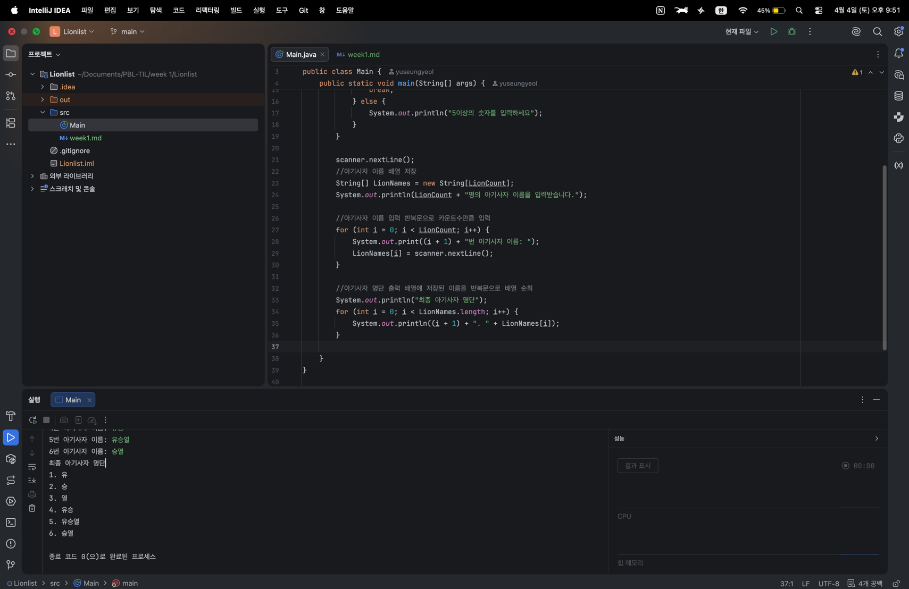

# 📘 Today I Learned

### 1. 오늘 배운 내용

* **표준 입출력의 흐름**
* **데이터 타입의 전략적 활용**
* **제어문을 통한 흐름 설계**
* **배열과 순회**

### 2. 핵심 정리

* **표준 입출력의 흐름**: `System.in`을 통해 키보드 데이터를 입력받고, Scanner 객체로 데이터를 가공(int, String)하여 프로그램 내부 변수에 할당한 뒤, System.out을 통해 결과를 사용자에게 보여주는 상호작용 구조를 이해함.
* **데이터 타입의 전략적 활용**: 단순 수치 데이터는 **기본 타입(int)** 으로, 문자열이나 집합 데이터는 **참조 타입(String, 배열)** 으로 구분하여 선언하고, 각 타입이 메모리에서 어떻게 다뤄지는지 학습함.
* **조건문(`if`)**: 입력값이 유효한지 검사하고(5 이상 여부), 조건에 따라 오류 메시지를 띄우거나 다음 단계로 진행하는 의사결정 로직을 구축함.
* **반복문(`while`)**: 유효한 값이 들어올 때까지 입력을 재요청하거나(`while`), 배열의 인덱스를 순회하며 여러 명의 이름을 효율적으로 저장 및 출력하는 자동화 구조를 구현함.  
* **배열**: 데이터마다 $0, 1, 2...$ 같은 인덱스(번호표)가 붙어 있습니다. 반복문의 변수($i$)가 이 번호를 순서대로 갈아 끼우며 배열의 각 칸을 자동으로 방문 Java에서 배열은 한 번 만들면 크기를 못 바꾼다. 그래서 먼저 숫자를 입력받고, 그 숫자를 이용해 `new String[count]`로 칸을 예약해야 한다.

        String[] LionNames = new String[LionCount];
        System.out.println(LionCount + "명의 아기사자 이름을 입력받습니다.");

        //아기사자 이름 입력 반복문으로 카운트수만큼 입력
        for (int i = 0; i < LionCount; i++) {  
            System.out.print((i + 1) + "번 아기사자 이름: ");
            LionNames[i] = scanner.nextLine();
        }

### 3. 결과 이미지(스크린샷)

### 4. 느낀 점
기초적인 문법들이라 이론적으로는 모두 완벽히 이해했다고 생각했는데, 막상 빈 화면에서 코드를 직접 짜보려니 생각만큼 손이 나가지 않아 당황스러웠습니다. 논리가 꼬일 때마다 급하게 해결하려 하기보다 구현해야 할 기능을 하나씩 천천히 복기하며 접근하니 막혔던 부분들이 금방 풀리는 것을 경험했습니다. 눈으로만 보는 공부와 직접 타이핑하며 고민하는 공부의 차이를 크게 체감했으며, 앞으로도 복잡한 로직을 만날수록 서두르지 않고 구조를 먼저 설계하는 습관을 들여야겠다고 다짐했습니다
