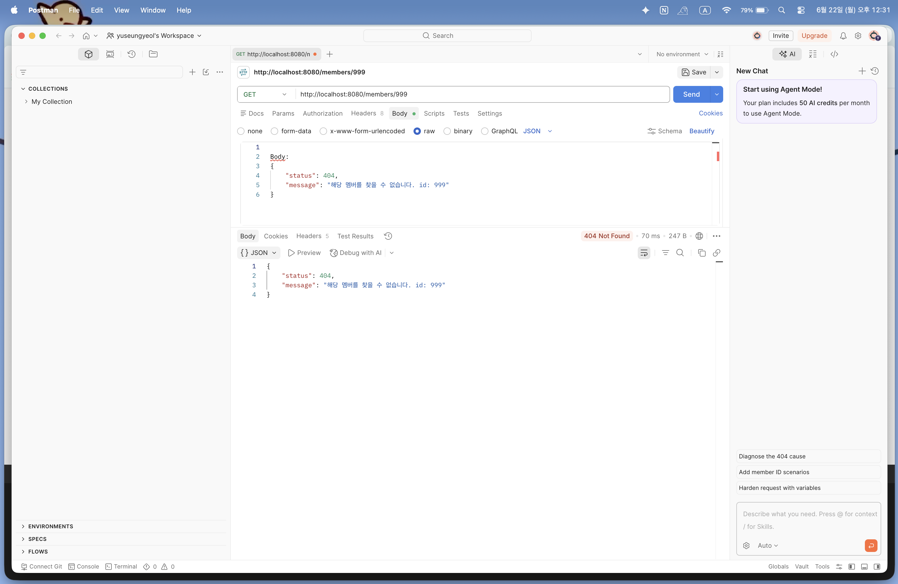
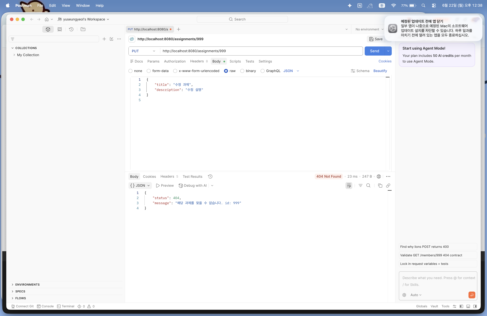
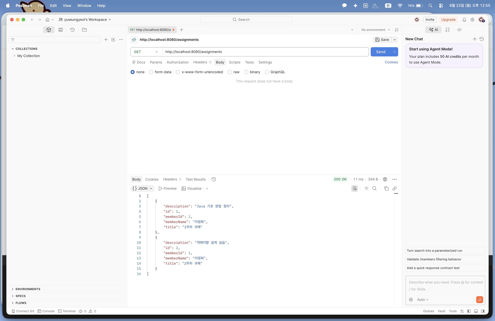
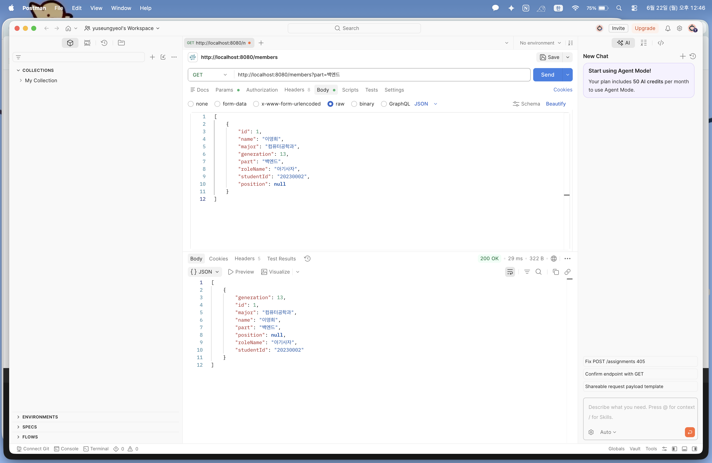
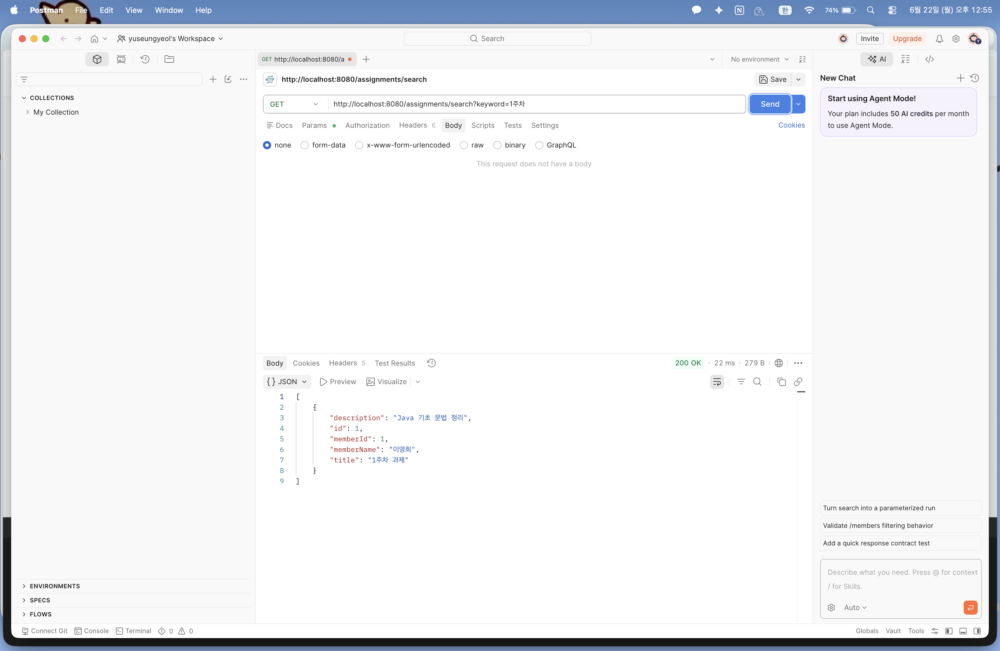
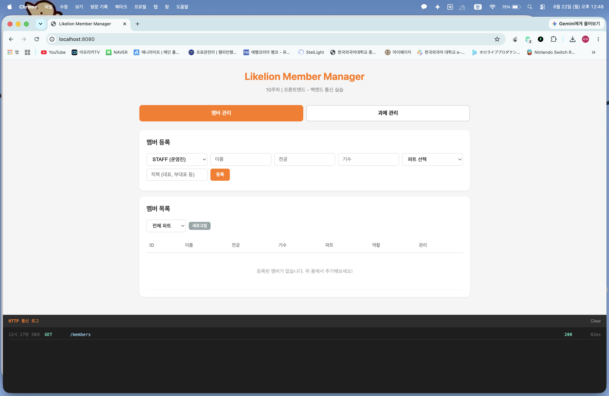

# Today I Learned (Week 10)

## 1. 이번 미션을 통해 배운 내용

- **전역 예외 처리(AOP)의 도입**: 각 컨트롤러 메서드마다 파편화되어 흩어져 있던 `if (result == null)` 형태의 예외 분기 로직을 전면 제거하고, `@RestControllerAdvice`를 활용해 전역에서 예외를 일괄 감시 및 통합 핸들링하는 구조를 확립함.
- **커스텀 예외 설계와 트랜잭션 롤백**: `RuntimeException`을 상속받는 비즈니스 커스텀 예외 클래스들을 직접 정의하여, 예외 발생 시 스프링의 `@Transactional` 장치와 자연스럽게 연동되어 안전하게 데이터 롤백이 유도되도록 설계함.
- **Spring Data JPA를 활용한 검색 기능**: JPA의 강력한 쿼리 메서드 네이밍 규칙인 `Containing` 키워드를 결합하여, SQL 문장을 직접 하드코딩하지 않고도 대용량 LIKE 문장 검색(`%keyword%`) 기능을 손쉽게 안착함.
- **프론트엔드-백엔드 데이터 통신 연동**: 백엔드가 규격화하여 내려주는 JSON 에러 응답 구조와 상태 코드가 실제 브라우저 자바스크립트(`fetch`) 환경에서 어떻게 파싱되어 사용자 토스트 알림창으로 연결되는지 전체적인 풀스택 흐름을 이해함.

## 2. 핵심 정리 (내 언어로)

- **@RestControllerAdvice와 @ExceptionHandler**: 예외가 터지면 즉시 실행 흐름을 가로채는 '에러 전용 관제탑'임. 서비스 레이어에서 특정 커스텀 예외를 공중으로 `throw` 던지면, 관제탑 내부의 `@ExceptionHandler`가 이를 낚아채서 약속된 `ErrorResponse` 상자에 상태 코드와 메시지를 예쁘게 담아 클라이언트에게 포맷팅해 내려줌.
- **Unchecked Exception 매핑 이유**: 백엔드 비즈니스 로직 중 터지는 대다수의 예외는 굳이 코드에 `try-catch`나 `throws` 선언을 명시하지 않아도 되는 `RuntimeException` 계열로 선언해야, 컨트롤러가 순수 정상 흐름에만 집중할 수 있고 코드가 간결해짐.

## 3. 결과 이미지 (Postman / 브라우저 테스트 스크린샷)

### [1] GET - 존재하지 않는 멤버 조회 시 예외 응답 (404 Not Found)

- **설명**: `/members/999` 경로로 조회 요청 시, 전역 관제탑이 발동하여 약속된 규격인 `status: 404`, `message: "해당 멤버를 찾을 수 없습니다."` JSON 객체가 정확하게 반환됨을 검증함.

### [2] POST - 중복 이름으로 멤버 등록 시 예외 응답 (409 Conflict)

- **설명**: 이미 디비에 적재되어 있는 똑같은 이름으로 생성을 시도할 때 서비스 레이어에서 즉시 예외를 발생시켜, 최종적으로 `409 Conflict` 상태 코드와 에러 텍스트가 바인딩되어 떨어짐을 확인.

### [3] PUT - 존재하지 않는 과제 수정 시 예외 응답 (404 Not Found)

- **설명**: 없는 과제 번호인 `/assignments/999` 경로로 수정을 요청함. `AssignmentNotFoundException` 장치가 정상 발동하여 안전하게 예외 차단 및 응답 처리됨을 확인.

### [4] GET - 전체 과제 목록 조회 성공 (200 OK)

- **설명**: 10주차 신규 명세인 `GET /assignments` 엔드포인트를 찔러, 데이터베이스에 보존되어 있던 전체 과제 이력 리스트가 JSON 배열 구조로 깨끗하게 반환됨을 검증함.

### [5] GET - 쿼리 파라미터를 활용한 파트별 멤버 필터링 성공 (200 OK)

- **설명**: 포스트맨이나 브라우저에서 `/members?part=백엔드`로 요청 시, 동적 쿼리 분기가 작동하여 백엔드 파트 소속 멤버만 온전히 필터링되어 리스팅되는 과정을 증명함.

### [6] GET - Containing 규칙을 활용한 과제 제목 검색 성공 (200 OK)

- **설명**: `/assignments/search?keyword=1주차` 주소로 키워드를 실어 보냄. JPA가 조립한 LIKE 쿼리에 의해 제목에 해당 글자가 포함된 과제만 정확하게 필터링되어 응답됨.

### [7] WEB - 실제 브라우저 화면 연동 및 HTTP 통신 로그 확인

- **설명**: 완성된 백엔드 구동 상태에서 `http://localhost:8080` 실제 화면에 진입한 모습임. 탭 전환과 등록/삭제 등 사용자 이벤트 발생 시 하단 통신 패널에 실시간으로 정상 상태 코드(`200`, `201`) 및 에러 토스트 팝업이 유기적으로 연동되어 돌아가는 풀스택 통신 시스템을 최종 확인함.

## 4. 미션 수행 후 느낀 점

그동안은 비즈니스 로직을 짜는 와중에도 예외 상황이 생기면 컨트롤러와 서비스 양쪽 모두에서 `if`문으로 `null`값을 검사하고 응답 객체를 억지로 만드는 코드가 누적되어 코드가 무척 지저분하고 복잡해 보였습니다.
이번 10주차 미션을 통해 스프링의 전역 예외 처리 메커니즘을 제대로 구축해 보면서 백엔드 컨트롤러가 오직 '정상적인 비즈니스 호출과 응답'이라는 본연의 책임에만 깔끔하게 집중할 수 있도록 아키텍처를 개편하는 경험이 매우 신선하고 짜릿했습니다.
특히 마지막 단계에서 제공된 실제 프론트엔드 정적 리소스 화면을 연결해 보며, 내가 만든 API가 브라우저 버튼 클릭에 반응하여 데이터를 생생하게 로드하고, 예외 발생 시 예쁜 알림창 메시지로 직결되는 연동 과정을 눈으로 보게 되어 정말 뿌듯했습니다. 이로써 10주간의 대장정을 거쳐 진정한 의미의 현대적 웹 애플리케이션 구조를 완전하게 체득하게 된 귀중한 시간이었습니다!
