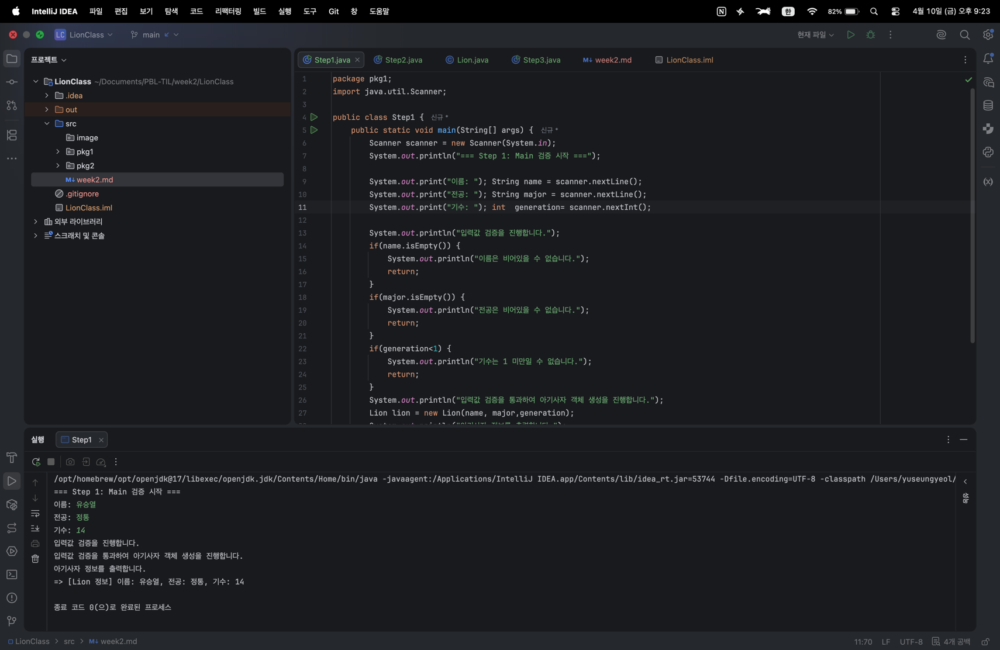
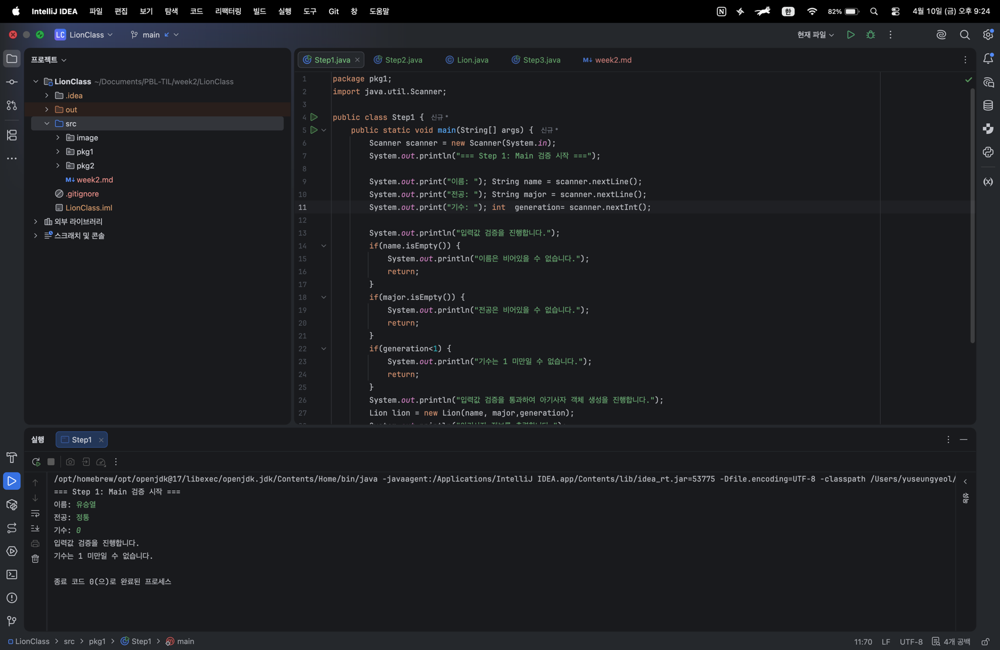
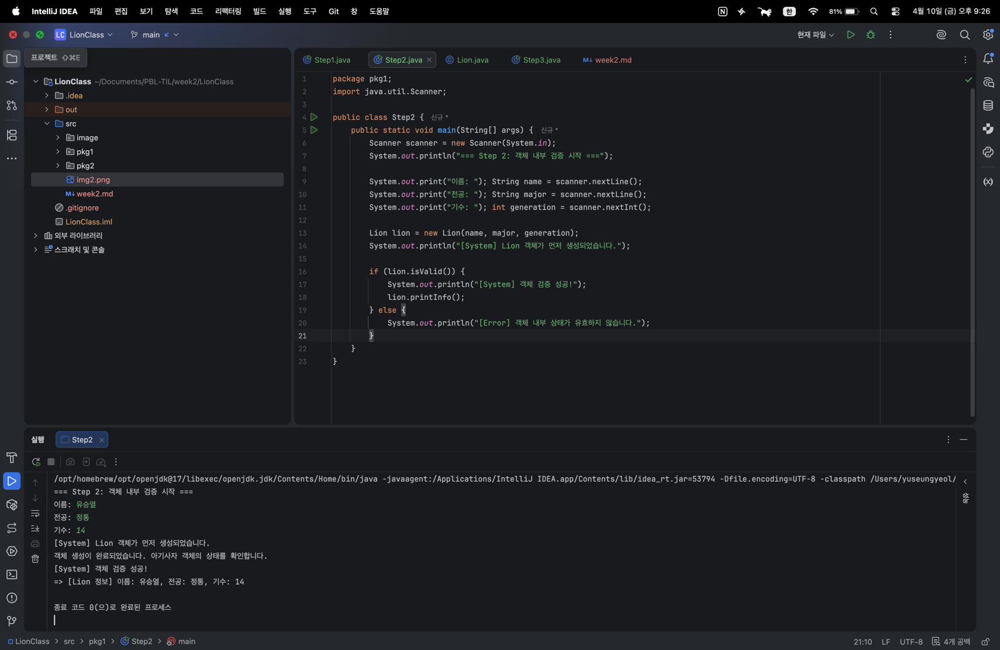
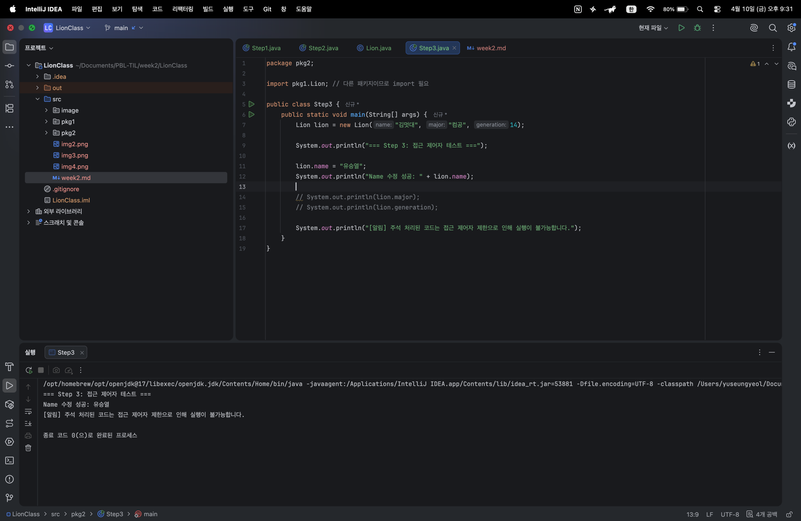
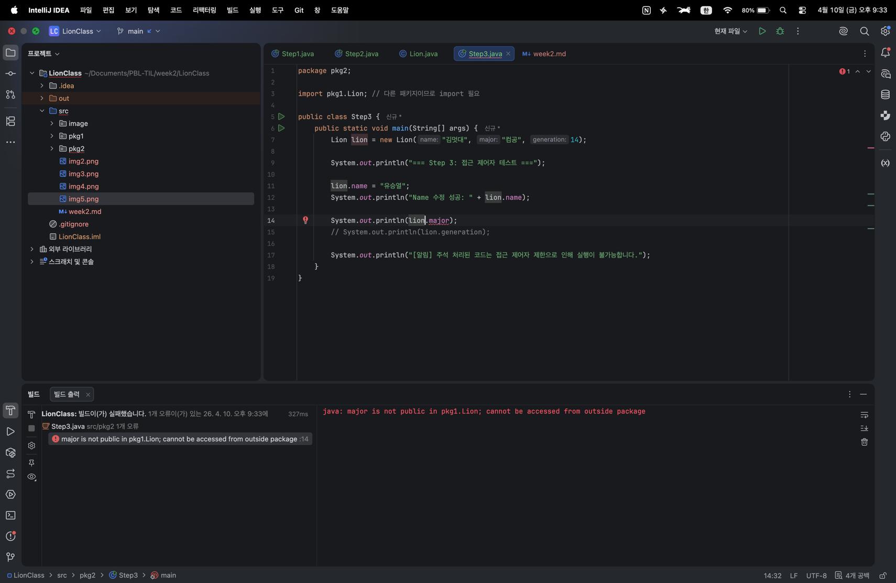
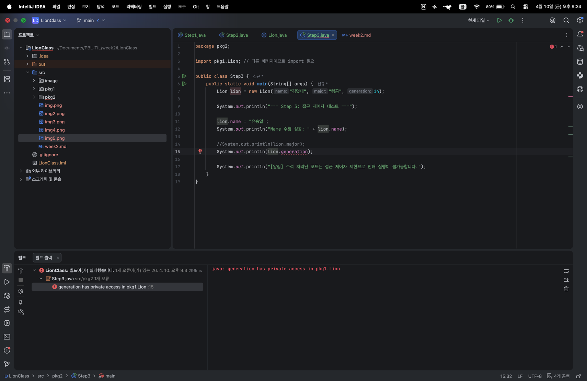

# Today I Learned

### 1. 오늘 배운 내용
- 객체 지향 프로그래밍(OOP) 기초: 데이터를 변수로 흩어놓지 않고 객체라는 단위로 묶어 관리하는 법 학습.
- 책임의 분리: 유효성 검증 로직을 어디에 두느냐에 따른 코드 구조의 변화 분석.
- 접근 제어자 활용: public, default, private 제어자를 통해 데이터 접근 권한을 제한하고 객체를 보호하는 실습 진행.

### 2. 핵심 정리 (내 언어로)

#### [1] 객체로 표현하기와 책임 분리
- 변수 vs 객체: 여러 개의 변수로 관리하면 데이터 사이의 관계를 파악하기 어렵지만, Lion 객체로 표현하면 '아기사자'라는 하나의 개념으로 데이터와 기능(메서드)을 일관성 있게 다룰 수 있습니다.
- 도메인 클래스의 책임: Lion 클래스가 스스로의 데이터가 유효한지 검사하게 함으로써, main 메서드는 복잡한 검증 로직을 직접 구현할 필요 없이 객체의 기능을 호출하기만 하면 됩니다.

#### [2] 유효성 검증 책임의 위치
- Step 1 (Main 검증): 객체 생성 전에 미리 검사하므로 잘못된 객체가 만들어지는 것을 막을 수 있습니다. 하지만 비슷한 검증이 필요할 때마다 main에 코드를 반복해서 적어야 합니다.
- Step 2 (객체 내부 검증): 일단 객체를 만든 뒤 객체의 isValid()를 사용합니다. 검증 로직이 객체 내부에 있으므로, 어디서든 Lion 객체만 있으면 동일한 검증 기능을 재사용할 수 있어 관리가 효율적입니다.

#### [3] 접근 제어자 체감
- 접근 범위의 이해:
    - public (name): 패키지가 달라도 어디서든 수정 가능.
    - default (major): 같은 패키지 안에서만 보이고 외부 패키지(pkg2)에서는 숨겨짐.
    - private (generation): 오직 Lion 클래스 내부에서만 접근 가능하여 외부의 잘못된 수정을 원천 봉쇄함.
- 캡슐화: 필드를 private으로 숨기는 것은 객체의 중요한 상태 정보가 외부 환경에 의해 오염되지 않도록 보호하는 역할을 합니다.

### 3. 결과 이미지(스크린샷)
#### [1] (Step 1) main에서 유효성 검증하는 경우
- **올바른 입력값을 입력한 경우**:
   
- **잘못된 입력값을 입력한 경우**:
    

#### [2] (Step 2) 객체 내부에서 유효성 검증하는 경우
- **올바른 입력값을 입력한 경우**:

- **잘못된 입력값을 입력한 경우**:
   

#### [3] (Step3) 접근 제어자에 따른 필드 접근 차이 확인
- **public 필드에 접근한 경우**:

- **default 필드에 접근을 시도한 경우**:
 

- **private 필드에 접근을 시도한 경우**:
    

### 4. 느낀 점
이번 미션을 통해 코드를 '작동시키는 것'과 '객체 지향적으로 설계하는 것'의 차이를 체감했습니다.

Step 1처럼 main에서 검증하면 당장은 편하지만, 객체가 많아질수록 중복 코드가 늘어나는 비효율이 생깁니다. 반면 Step 2에서 검증 책임을 객체 내부(isValid)로 옮기자 main 코드가 간결해졌고, 객체 스스로 상태를 관리하는 응집도 높은 설계의 중요성을 깨달았습니다.

또한 Step 3에서 패키지를 분리해 접근 제어자를 테스트하며 캡슐화의 위력을 실감했습니다. 특히 private 필드가 외부에서 원천 차단되는 에러를 보며, 개발자의 실수를 방지하고 데이터를 보호하는 방어적 설계의 원리를 이해했습니다. 단순히 문법으로만 알던 개념들이 실제 구조에서 어떻게 코드의 안정성을 높이는지 배울 수 있었던 유익한 실습이었습니다.