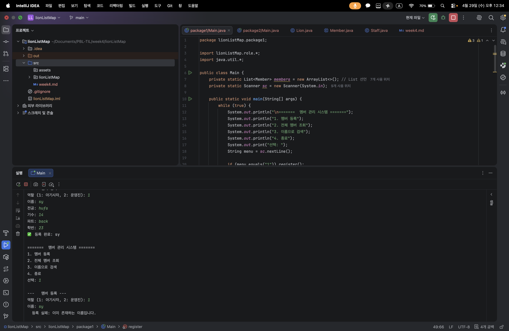
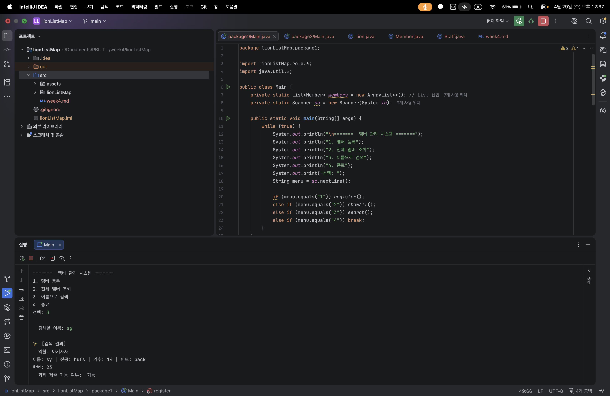
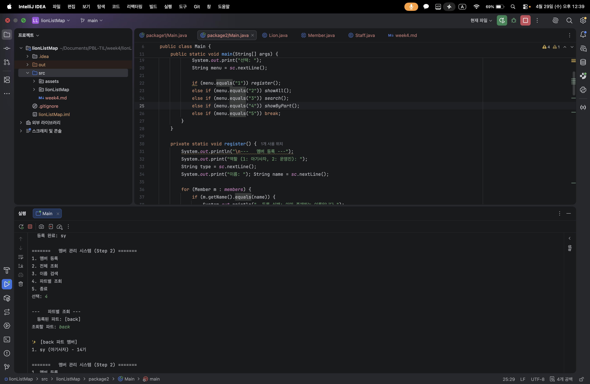

# Today I Learned (Week 4)

### 1. 오늘 배운 내용

- **Java 컬렉션 프레임워크**: 배열의 한계를 넘어 동적으로 크기가 조절되는 `List`와 키-값 쌍으로 데이터를 관리하는 `Map`의 활용법 학습.
- **데이터 그룹화**: `Map<String, List<Member>>` 구조를 통해 파트별로 멤버를 분류하고 효율적으로 조회하는 로직 구현.
- **제네릭(Generic) 활용**: 컬렉션 선언 시 타입을 명시하여 타입 안정성을 보장하고 불필요한 타입 변환을 방지하는 방법 체득.

### 2. 핵심 정리 (내 언어로)

#### [1] List를 통한 동적 멤버 관리

- **배열 vs List**: 1주차에서 사용한 배열은 크기가 고정되어 불편했지만, `List`는 `add()`를 통해 멤버를 무제한으로 추가할 수 있어 실제 서비스 환경에 훨씬 적합합니다.
- **중복 검사**: 새로운 멤버를 등록하기 전, `for-each` 문으로 리스트를 순회하며 기존 이름과 비교해 데이터의 무결성을 유지하는 법을 배웠습니다.

#### [2] Map을 활용한 파트별 필터링

- **키(Key) 기반 조회**: 파트 이름을 키로 사용해 해당 파트의 멤버 리스트를 즉시 찾아낼 수 있습니다. 이는 전체 리스트를 매번 처음부터 끝까지 뒤질 필요가 없게 만들어 검색 효율을 높여줍니다.
- **그룹화 로직**: `computeIfAbsent`를 활용해 특정 파트가 처음 등록될 때만 리스트를 새로 생성하고, 이후에는 기존 리스트에 추가하는 효율적인 데이터 적재 방식을 익혔습니다.

#### [3] 컬렉션과 다형성의 결합

- **타입 통합**: `List<Member>`라는 하나의 바구니에 아기사자(`Lion`)와 운영진(`Staff`)을 함께 담을 수 있는 것은 상속 관계 덕분입니다.
- **일관된 처리**: 리스트에 담긴 객체가 무엇이든 `m.checkSubmissionStatus()`만 호출하면 각자의 정책에 따라 결과를 내놓는 다형성의 위력을 컬렉션 환경에서도 실감했습니다.

### 3. 결과 이미지(스크린샷)

#### [1] (Step 1) 중복 등록 방지 로직

- **이미 존재하는 이름을 입력했을 때 등록을 거부하는 화면**:
- 

#### [2] (Step 1) 전체 멤버 조회

- **등록된 모든 멤버를 리스트업한 화면**:
  

#### [3] (Step 1) 이름으로 상세 검색 (다형성 확인)

- **특정 멤버 검색 시 역할에 따른 상세 정보와 제출 정책이 반영된 화면**:
- 

#### [4] (Step 2) 파트별 멤버 그룹 조회

- **Map을 활용하여 특정 파트 멤버만 필터링하여 출력한 화면**:
- 

### 4. 느낀 점

이번 미션을 통해 3주차까지 구축한 다형성 구조가 컬렉션을 만났을 때 비로소 완성된 '시스템'이 된다는 것을 느꼈습니다.

단순히 문법적으로 `List`와 `Map`을 사용하는 것을 넘어, 데이터를 어떻게 구조화하느냐에 따라 검색 효율과 관리 편의성이 얼마나 달라지는지 체감할 수 있었습니다. 특히 `Map`을 활용해 파트별로 멤버를 묶어내는 과정에서 효율적인 데이터 관리의 중요성을 배웠으며, 제네릭을 통해 타입 안정성을 확보하는 것이 대규모 데이터를 다룰 때 얼마나 큰 안정감을 주는지 깨달았습니다. 객체지향의 원칙을 지키면서 컬렉션을 활용하는 균형 잡힌 설계의 즐거움을 알게 된 유익한 실습이었습니다.
