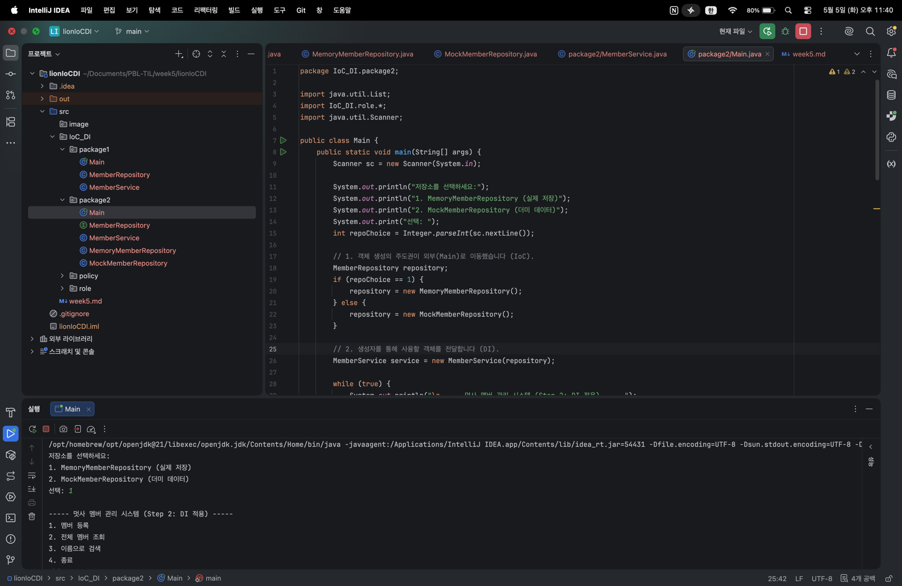
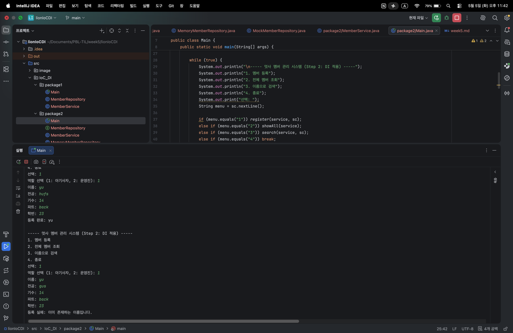
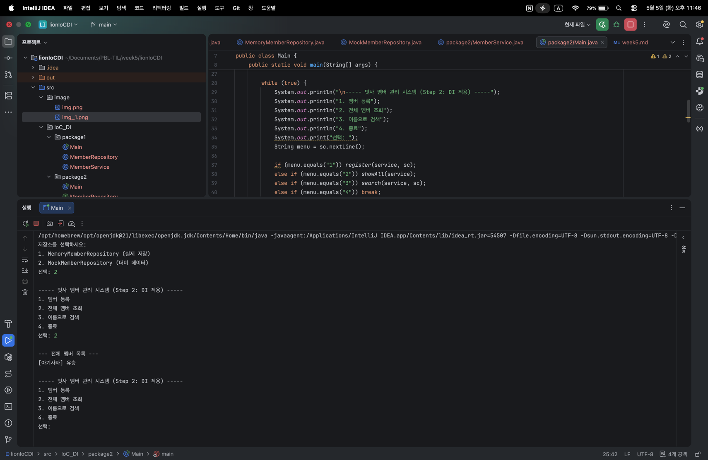
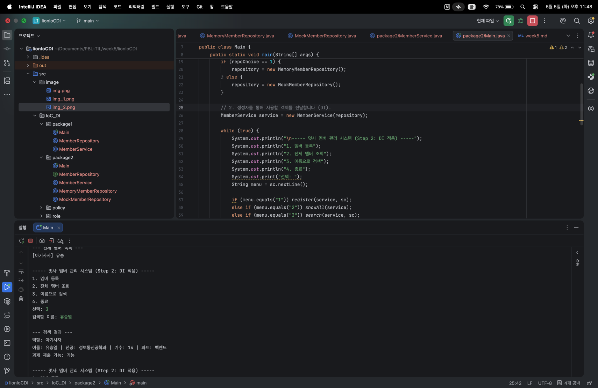

# Today I Learned (Week 5)

### 1. 오늘 배운 내용
- **레이어 분리 (Layered Architecture)**: Main(UI), Service(비즈니스 로직), Repository(데이터 접근)로 역할을 나누어 코드의 응집도를 높이는 방법을 학습함.
- **의존성 주입 (Dependency Injection)**: 객체를 내부에서 직접 생성하지 않고 외부에서 생성자를 통해 주입받음으로써 클래스 간 결합도를 낮춤.
- **제어의 역전 (Inversion of Control)**: 객체의 생명주기 관리 권한을 Service가 아닌 외부(Main)로 넘겨 설계의 유연성을 확보함.
- **인터페이스 기반 설계**: 추상화된 인터페이스에 의존함으로써 구현체가 바뀌어도 클라이언트(Service) 코드를 수정할 필요가 없는 설계를 실습함.

### 2. 핵심 정리 (내 언어로)

#### [1] 강한 결합 vs 느슨한 결합
- **Step 1 (강한 결합)**: Service 내부에서 `new Repository()`를 선언하면, 저장 방식을 바꿀 때마다 Service 코드도 함께 고쳐야 하는 불편함이 있었습니다.
- **Step 2 (느슨한 결합)**: Service가 인터페이스만 바라보게 하고 생성자로 주입받으니, Service 코드는 그대로 둔 채 저장소만 갈아 끼울 수 있게 되었습니다.

#### [2] Repository의 역할 분담
- **인터페이스화**: 저장소의 규격(save, find 등)을 인터페이스로 정의하여 어떤 구현체가 오더라도 동일한 메서드로 소통할 수 있게 합니다.
- **Memory vs Mock**: 실제 데이터를 다루는 Memory 구현체와, 테스트를 위해 가짜 데이터를 즉시 반환하는 Mock 구현체를 만들어 DI의 효과를 직접 확인했습니다.

#### [3] 생성자 주입의 장점
- **불변성 보장**: `final` 키워드를 사용하여 한 번 주입된 의존성이 프로그램 실행 도중 변하지 않도록 안전하게 관리할 수 있습니다.
- **테스트 용이성**: 실제 DB가 없어도 Mock 객체를 주입하여 Service의 로직만 독립적으로 검증할 수 있다는 점이 매우 유용했습니다.

### 3. 결과 이미지(스크린샷)

#### [1] 저장소 선택 및 메뉴 화면
- **프로그램 시작 시 사용할 저장소(Memory/Mock)를 선택하는 화면**:
  
> 설명: 실행 시점에 어떤 구현체를 주입할지 결정하는 IoC의 과정을 보여줍니다.

#### [2] 멤버 등록 및 중복 체크
- **Memory 저장소 선택 후 멤버를 등록하고 중복을 확인하는 화면**:
  
> 설명: Service 레이어에서 중복 로직을 처리하고 Repository에 안전하게 저장합니다.

#### [3] Mock 저장소 조회 결과
- **Mock 저장소 선택 시 등록과 상관없이 더미 데이터가 조회되는 화면**:
  
> 설명: Service 코드를 고치지 않고 주입받는 객체만 바꾸어 동작이 달라지는 DI의 핵심을 증명합니다.

#### [4] 이름으로 검색 (상세 정보)
- **상세 검색을 통해 레이어를 거쳐온 데이터를 출력하는 화면**:
   
> 설명: Repository에서 꺼내온 Member 객체의 상세 정보를 UI 레이어인 Main에서 보여줍니다.

### 4. 느낀 점
이번 미션을 통해 Spring 프레임워크의 핵심인 DI와 IoC가 왜 필요한지 뼈저리게 느꼈습니다.

처음에는 단순히 레이어를 나누는 것이 코드가 길어지는 것처럼 느껴졌지만, 직접 `Memory`에서 `Mock`으로 저장소를 갈아 끼우면서도 `MemberService` 코드를 단 한 줄도 수정하지 않는 경험을 하니 설계의 유연성이 무엇인지 알 것 같았습니다.

"객체를 직접 생성하면 왜 문제가 되는지"에 대한 답을 스스로 찾을 수 있었던 시간이었습니다. 특히 인터페이스를 사이에 두는 것만으로도 클래스 간의 관계가 얼마나 유연해질 수 있는지 배웠으며, 이러한 구조가 유지보수와 테스트에 얼마나 큰 강력함을 제공하는지 깨닫게 된 소중한 실습이었습니다.