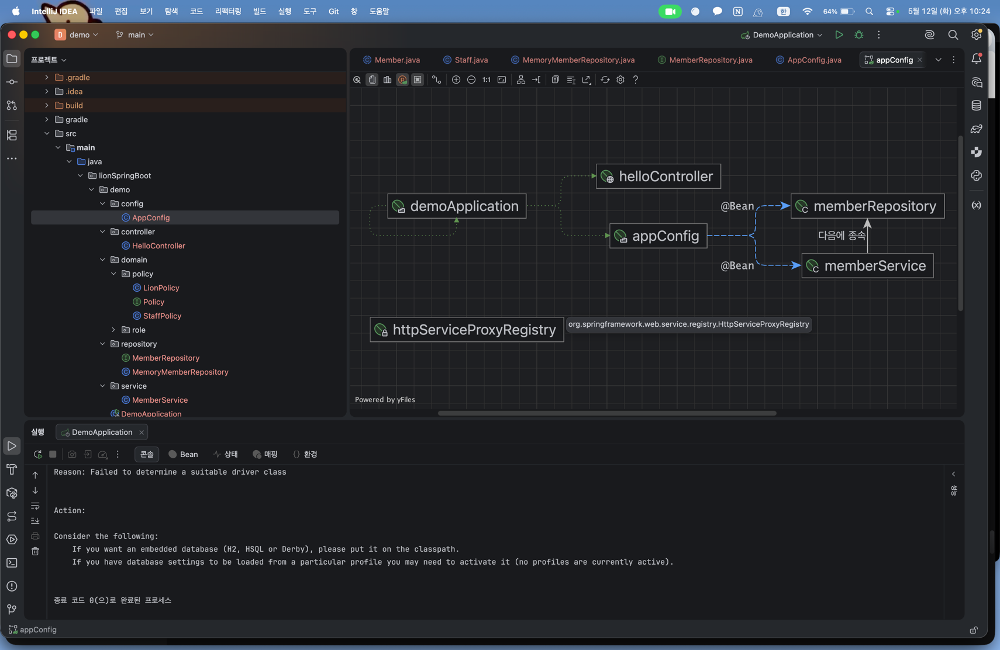
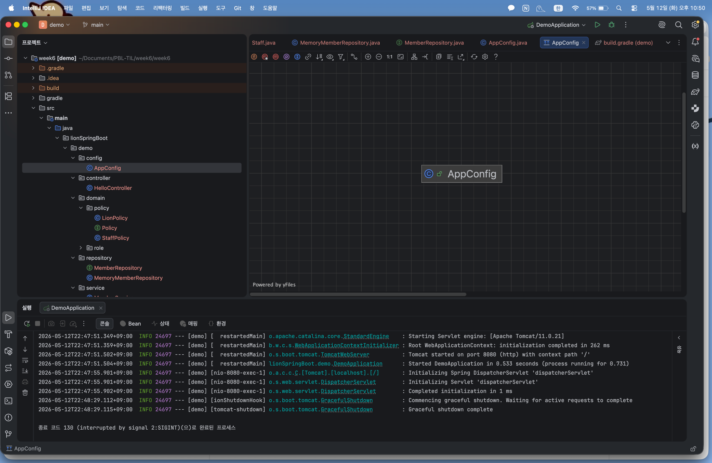
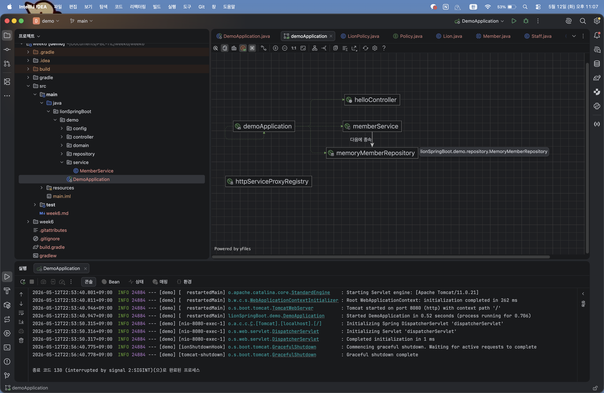
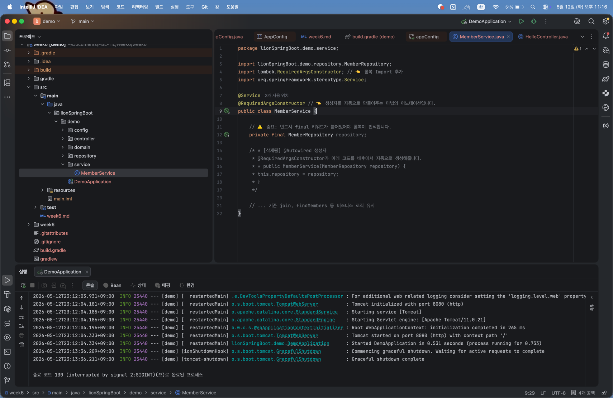
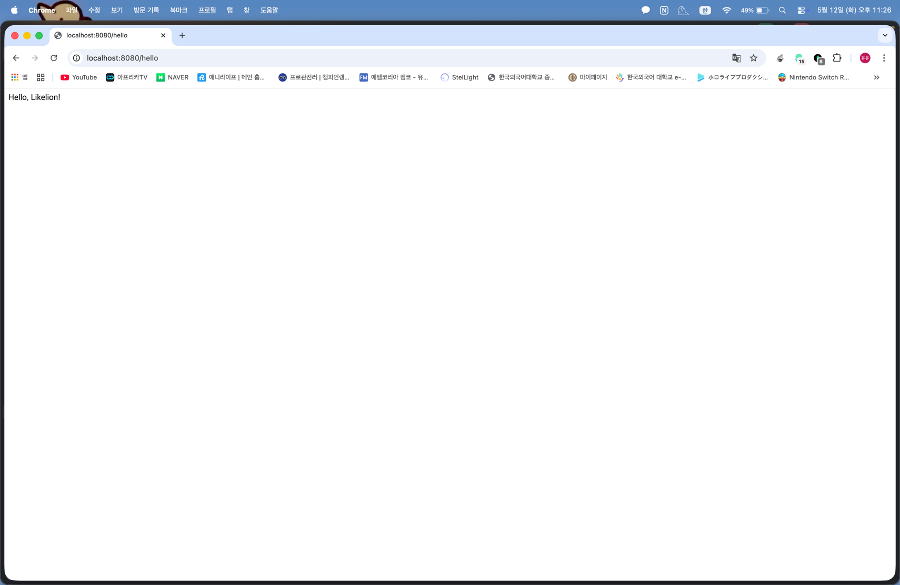

# qToday I Learned (Week 6)

## 1. 오늘 배운 내용

- **스프링 컨테이너와 빈(Bean)**: 객체의 생성과 생명주기 관리를 자바 메인 메서드가 아닌 스프링 컨테이너가 담당하도록 설정함.
- **컴포넌트 스캔(Component Scan)**: 어노테이션(@Service, @Repository)을 통해 스프링이 자동으로 빈을 찾아 등록하는 방식을 학습함.
- **의존성 자동 주입(@Autowired)**: 생성자 주입 방식을 스프링이 자동으로 처리하여 객체 간의 결합도를 낮추는 과정을 실습함.
- **롬복(Lombok) 기반 최적화**: @RequiredArgsConstructor를 활용해 반복되는 생성자 코드를 제거하고 가독성을 극대화함.

## 2. 핵심 정리 (내 언어로)

### [1] 수동 주입 vs 자동 주입

- **Step 1 (수동 주입)**: `AppConfig` 클래스에서 `@Bean`을 사용해 직접 객체를 조립했습니다. 설정 파일에서 전체 구조를 한눈에 볼 수 있지만, 관리할 객체가 많아질수록 설정 코드가 길어지는 단점이 있었습니다.
- **Step 2 (자동 주입)**: 클래스 위에 `@Service`, `@Repository` 이름표만 달아주면 스프링이 알아서 객체를 생성합니다. 직접 조립하던 수고를 스프링이 대신해주어 개발 효율이 높아졌습니다.

### [2] 롬복(Lombok)을 이용한 코드 최적화

- **@RequiredArgsConstructor**: `private final`로 선언된 필드를 파라미터로 받는 생성자를 롬복이 컴파일 시점에 자동으로 생성해줍니다.
- **결과**: 수동으로 작성해야 했던 생성자 주입 코드(`@Autowired public MemberService...`)가 어노테이션 한 줄로 대체되어 코드가 매우 간결해졌습니다.

### [3] 다이어그램을 통한 의존성 확인

- **시각적 증명**: 인텔리제이의 Diagram 기능을 통해 `MemberService`가 `MemoryMemberRepository`를 정상적으로 참조하고 있는지 화살표 방향을 확인하며 DI의 원리를 이해했습니다.

## 3. 결과 이미지(스크린샷)

### [1단계] 수동 주입

### [2단계] 자동 주입

### [3단계] 롬복(Lombok)

### [4단계] API 응답 브라우저에서

## 4. 느낀 점

5주차에 직접 구현했던 수동 DI를 스프링이 어떻게 자동으로 처리해주는지 배우면서 프레임워크의 편리함을 크게 느꼈습니다.
처음에는 눈에 보이는 조립 코드(`AppConfig`)를 지우는 것이 불안했지만, 다이어그램을 통해 화살표가 정확히 연결된 것을 보니 스프링 컨테이너의 동작 원리를 신뢰할 수 있게 되었습니다.
특히 롬복을 사용하면서 지루한 생성자 반복 코드가 사라지는 과정이 매우 인상 깊었습니다. 단순히 기능을 만드는 것을 넘어, 도구를 활용해 더 깔끔하고 유지보수하기 좋은 코드를 설계하는 법을 배운 소중한 실습이었습니다.
