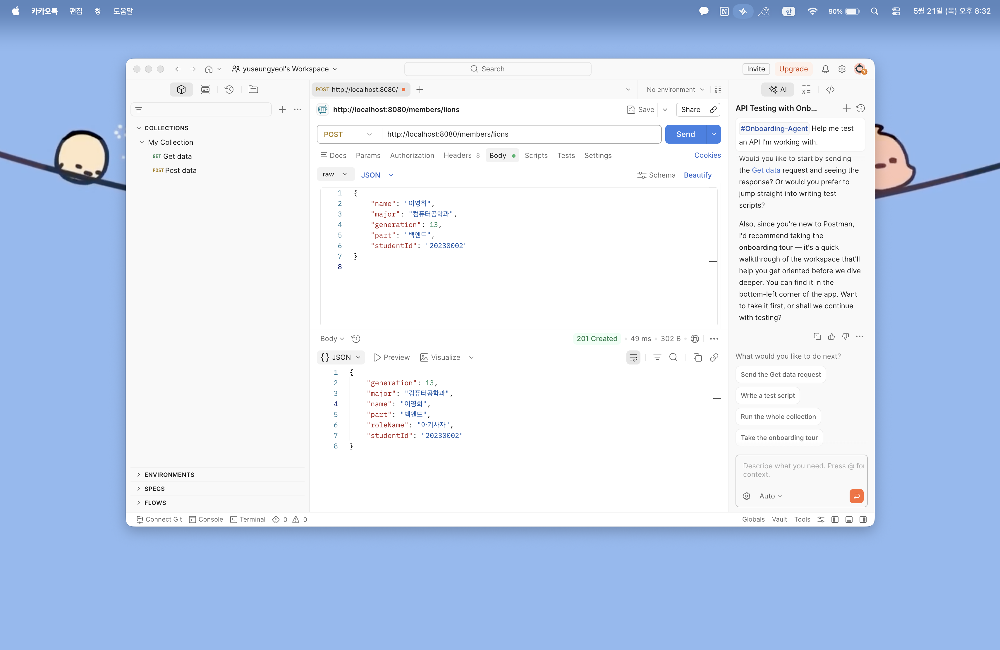
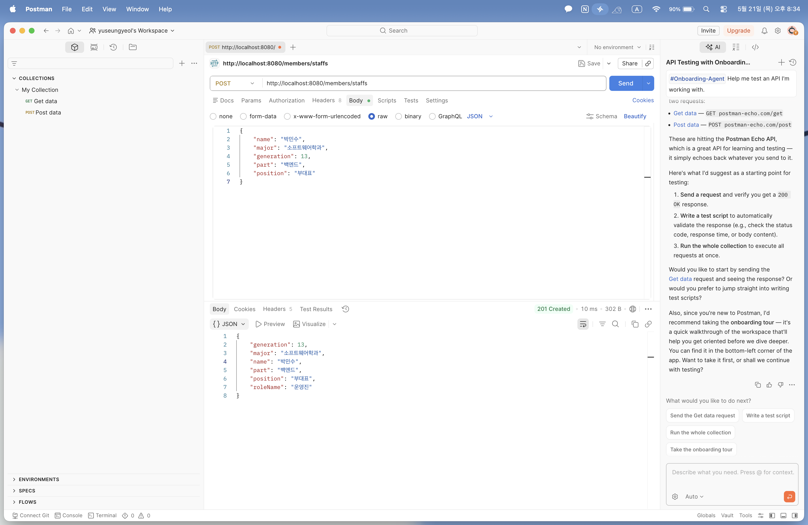
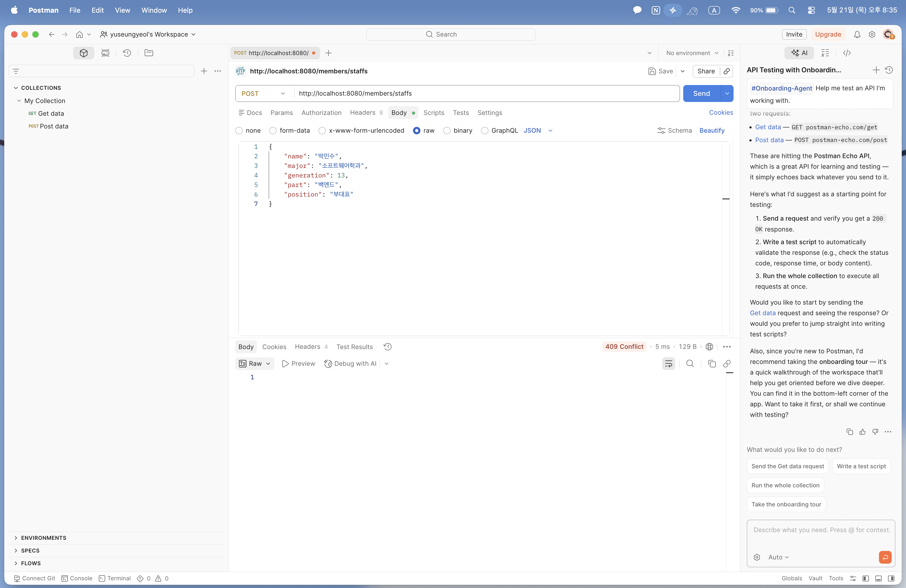
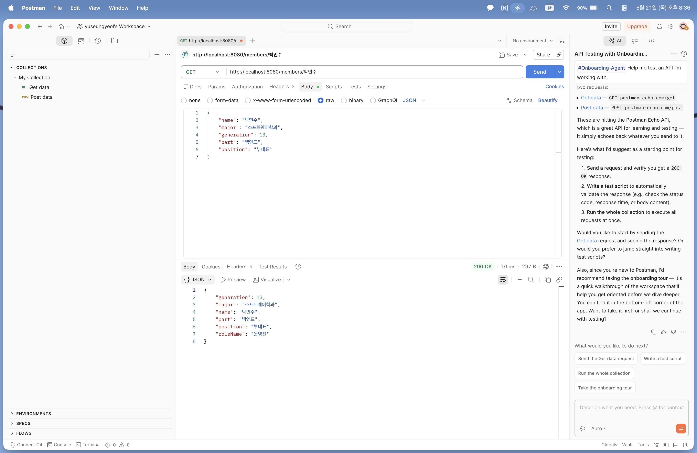
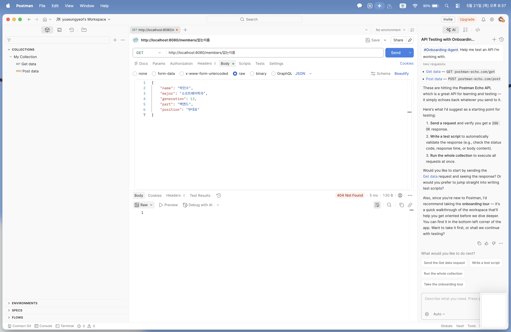
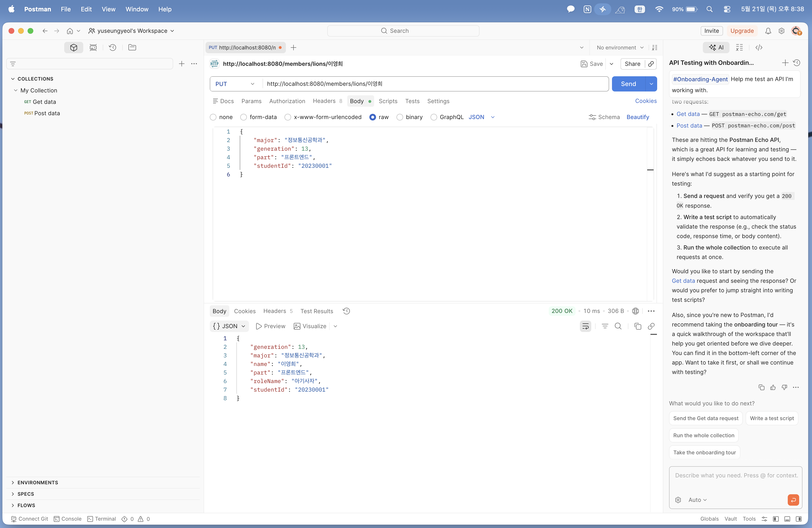
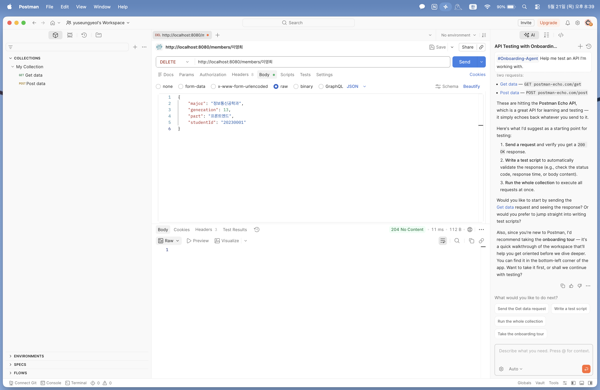

# Today I Learned (Week 7)

## 1. 이번 미션을 통해 배운 내용

- **REST API 설계 원칙**: URI는 명사 자원(`/members`)으로 표현하고, 행위는 HTTP 메서드(GET, POST, PUT, DELETE)로 분리하여 설계하는 구조를 학습함.
- **DTO(Data Transfer Object)의 필요성**: 무거운 도메인 객체(`Member`)를 외부에 직접 노출하지 않고, 클라이언트 요청/응답에 딱 필요한 데이터만 안전하게 담아 전달하는 독립된 상자의 역할을 이해함.
- **상태 코드(Status Code) 제어**: `ResponseEntity`를 활용해 작업 결과에 따라 201(Created), 200(OK), 409(Conflict), 404(NotFound), 204(NoContent) 등의 HTTP 상태 코드를 명확하게 명시해 주는 방법을 실습함.
- **다형성 처리와 데이터 분리**: 부모 클래스(`Member`) 공통 필드와 자식 클래스(`Lion`, `Staff`)의 고유 필드를 구별하고, 컨트롤러 계층에서 `instanceof`를 통해 동적으로 적절한 DTO 상자로 변환해 주는 로직을 구현함.

## 2. 핵심 정리 (내 언어로)

- **@PathVariable vs @RequestBody**: `@PathVariable`은 주소창 경로에 들어오는 식별자 값(예: `/members/이영희`에서 `이영희`)을 꺼내올 때 사용하고, `@RequestBody`는 Postman의 Body 탭에 실려오는 JSON 택배 상자 데이터 전체를 자바 객체로 변환하여 통째로 받아올 때 사용합니다.
- **역할별 DTO 분리 이유**: 아기사자(Lion)는 '학번(studentId)', 운영진(Staff)은 '직책(position)'이라는 서로 다른 고유 정보를 다룹니다. 하나의 상자에 모든 필드를 때려 박으면 불필요한 null 데이터가 생기거나 보안상 좋지 않기 때문에 요청과 응답 상자를 명확히 분리하여 설계해야 합니다.

## 3. 결과 이미지 (Postman 테스트 스크린샷)

### [1] POST - Lion(아기사자) 등록 성공 (201 Created)

- **설명**: `/members/lions` 주소로 JSON 데이터를 POST 요청하여, 상태 코드 `201 Created`와 함께 `roleName: "아기사자"`가 포함된 응답 상자가 정상 반환됨을 확인합니다.

### [2] POST - Staff(운영진) 등록 성공 (201 Created)

- **설명**: `/members/staffs` 주소로 운영진 정보를 POST 요청하여, 상태 코드 `201 Created`와 함께 고유 필드인 `position`과 `roleName: "운영진"`이 찍힌 결과를 확인합니다.

### [3] POST - 이름 중복 등록 실패 예외 처리 (409 Conflict)

- **설명**: 이미 존재하는 이름으로 동일하게 등록을 시도했을 때, 서비스 계층의 중복 검증 로직에 걸려 `409 Conflict` 상태 코드가 정상 반환됨을 증명합니다.

### [4] GET - 단일 멤버 이름 조회 성공 (200 OK)

- **설명**: GET 방식으로 `/members/박민수`를 호출했을 때, 메모리 저장소에서 해당 멤버를 판별하여 알맞은 StaffResponse JSON 형태와 `200 OK`를 돌려주는 화면입니다.

### [5] GET - 존재하지 않는 이름 조회 실패 (404 Not Found)

- **설명**: 저장소에 없는 이름을 조회했을 때, 예외 처리를 통해 `404 Not Found` 에러 코드가 깔끔하게 떨어지는지 확인합니다.

### [6] PUT - Lion(아기사자) 정보 수정 성공 (200 OK)

- **설명**: PUT 메서드로 `/members/lions/이영희` 경로에 수정할 바디 데이터를 실어 보냈을 때, 학과 및 파트 정보가 정상 변경되고 `200 OK` 응답이 오는 화면입니다.

### [7] DELETE - 이름으로 멤버 삭제 성공 (204 No Content)

- **설명**: DELETE 메서드로 `/members/이영희`를 호출하여 리스트에서 안전하게 제거되었음을 확인하고, 반환할 본문 데이터가 없으므로 규격에 맞는 `204 No Content`가 뜨는 것을 검증합니다.

## 4. 미션 수행 후 느낀 점

그동안 자바 메인 메서드 내부나 테스트 코드로만 확인하던 데이터의 흐름을, 직접 웹 컨트롤러를 개설하고 Postman이라는 도구를 통해 주고받아 보니 진짜 살아있는 웹 서비스를 만드는 기분이 들어서 매우 흥미로웠습니다.
처음에는 똑같은 필드들을 왜 굳이 도메인과 DTO로 쪼개서 복잡하게 주고받아야 하는지 의문이 들었지만, 역할군(Lion, Staff)에 따라 필요한 데이터 폼만 깔끔하게 규격화하여 통신하는 구조를 직접 코드로 짜보면서 DTO 아키텍처의 강력함과 안정성을 체감할 수 있었습니다. HTTP 상태 코드를 프론트엔드나 클라이언트에 명확하게 약속된 번호로 쥐여주는 컨트롤러 제어 방식을 익히게 된 뜻깊은 실습이었습니다.
