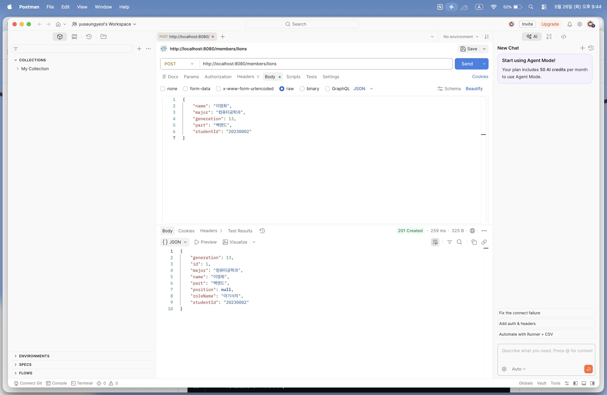
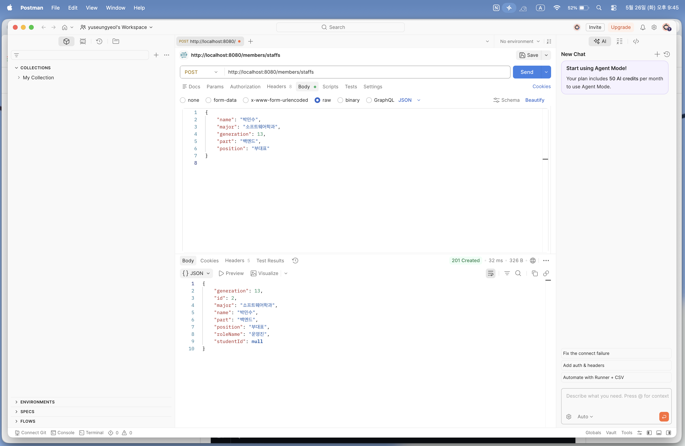
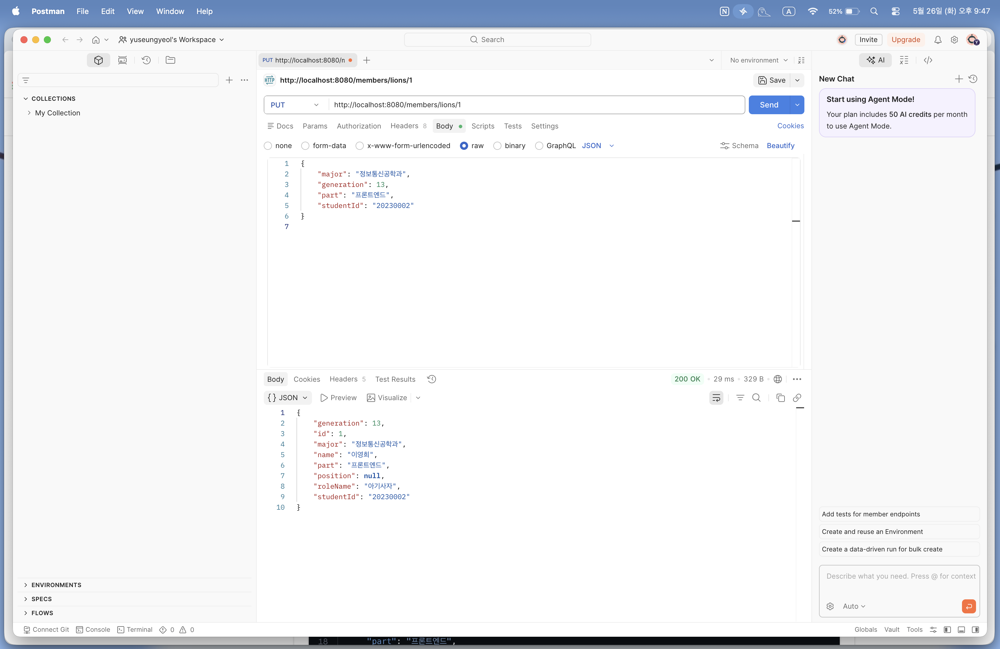
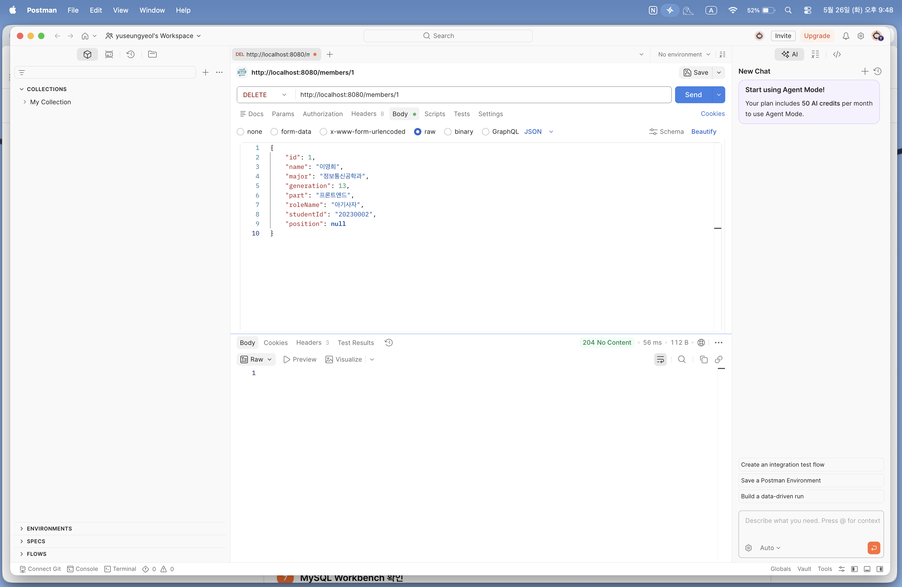
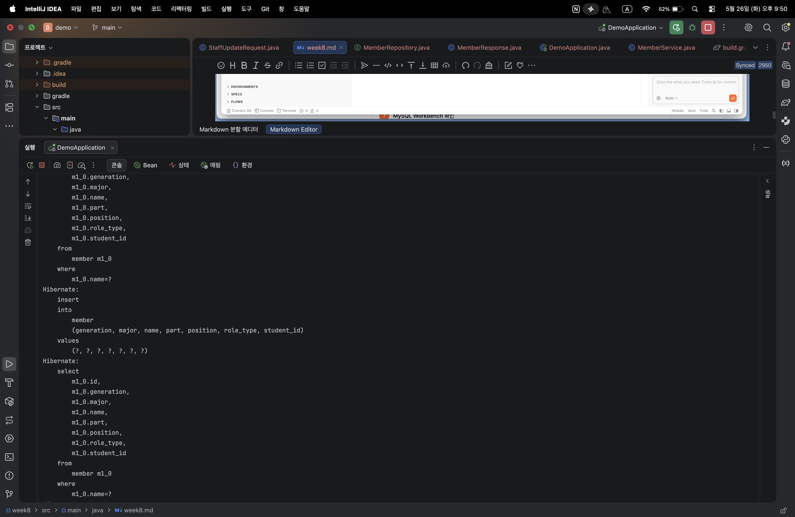
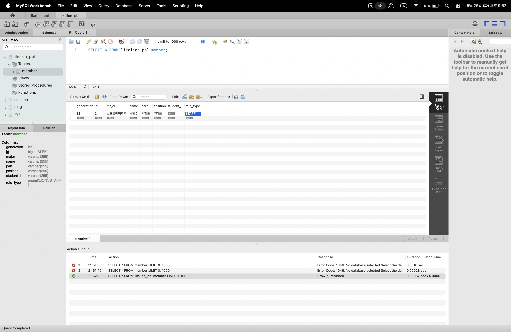

# Today I Learned (Week 8)

## 1. 이번 미션을 통해 배운 내용

- **관계형 데이터베이스(RDB) 매핑**: 자바의 객체지향 상속 구조가 RDB 환경에서 가질 수 있는 복잡성을 이해하고, 이를 단일 테이블(`Member`)과 역할 구분용 컬럼(`RoleType` Enum)으로 단순화하는 리팩토링 과정을 경험함.
- **JPA 엔티티(Entity) 설계**: `@Entity`, `@Id`, `@GeneratedValue` 등을 사용하여 자바 클래스와 데이터베이스 테이블을 1:1로 매핑하고, 대리 키(PK)를 `IDENTITY` 전략으로 설정해 영속성 컨텍스트를 통한 식별자 자동 생성 원리를 체감함.
- **JpaRepository 활용**: 상속 한 줄만으로 수동 저장소 구현 클래스 없이 기본적인 CRUD 메서드를 자동으로 제공받고, `findByName`과 같은 쿼리 메서드 네이밍 규칙을 통해 SQL을 자동 생성하는 방법을 학습함.
- **DTO 통합 및 간소화**: 데이터 모델이 하나로 통합됨에 따라 출력 상자인 응답 DTO(`MemberResponse`)를 하나로 묶어 중복 코드를 제거하고, API 계약 명확성을 위해 입력 상자(`Request DTO`)는 분리 상태를 유지하는 설계 구조를 확립함.

## 2. 핵심 정리 (내 언어로)

- **@PathVariable vs @RequestBody (ID 기반 전환)**: 7주차에는 이름(`{name}`)을 주소창 경로에서 추출하여 식별했지만, 8주차부터는 명세서 양식 변경에 따라 DB 기본키인 숫자 번호(`{id}`)를 `@PathVariable`로 바인딩하여 제어함. 데이터를 보낼 때는 기존처럼 Body 탭의 JSON 데이터를 `@RequestBody`로 온전히 수신함.
- **ddl-auto=create와 영속성**: `ddl-auto=create` 옵션은 서버가 켜질 때마다 기존 테이블을 싹 밀고 새로 만들어 주므로 로컬 개발 시 테이블 동기화가 아주 편리함. 데이터를 `save()`하면 영속성 컨텍스트가 즉시 DB에 `INSERT`를 날려 자동 생성된 ID 번호를 엔티티 객체에 알아서 채워 넣어줌.

## 3. 결과 이미지 (Postman 테스트 스크린샷)

### [1] POST - Lion(아기사자) 등록 성공 (201 Created)

- **설명**: `/members/lions` 주소로 JSON 데이터를 전송하여 가동된 MySQL 테이블에 첫 데이터를 적재함. 응답 결과에 자동 생성 키 번호 `id: 1`과 `roleName: "아기사자"`가 정상 반환됨을 확인.

### [2] POST - Staff(운영진) 등록 성공 (201 Created)

- **설명**: `/members/staffs` 주소로 운영진 정보를 전송함. 순차적으로 증가된 `id: 2` 번호와 함께 고유 필드인 `position`, 통합 응답 서식에 맞춘 `roleName: "운영진"` 출력을 검증함.

### [3] GET - ID 기반 단일 멤버 조회 성공 (200 OK)

- **설명**: 경로 변수에 이름 대신 숫자 키값을 실어 `GET /members/1`로 호출함. DB에 보존되어 있던 1번 이영희 사자의 상자 데이터가 통합 포맷으로 명확히 조회됨.

### [4] PUT - ID 기반 Lion 정보 수정 성공 (200 OK)

- **설명**: `PUT /members/lions/1` 경로로 전공 및 파트 변경 데이터를 전달함. 영속성 상태의 엔티티가 변경 사항을 스스로 감지하여 학과가 정상 수정된 상태로 응답됨.

### [5] DELETE - ID 기반 멤버 삭제 성공 (204 No Content)

- ****설명**: `DELETE` 메서드를 사용하여 `/members/1` 경로로 삭제 요청을 전송함. 서버에서 해당 ID의 멤버 데이터를 성공적으로 제거했으며, 반환할 본문 내용이 없음을 의미하는 표준 상태 코드 `204 No Content`가 정상적으로 도출됨을 확인.

### [6] 콘솔 SQL 출력 확인 캡처

- **설명**: 데이터가 저장될 때 인텔리제이 하단 로그 창에 Hibernate가 자동으로 생성하여 날려준 `insert into member...` 포맷팅 SQL 문장을 확인하여 영속 장치가 살아있음을 증명함.

### [7] MySQL Workbench 데이터 저장 실시간 확인

- **설명**: 워크벤치에서 `SELECT * FROM member;`를 실행하여 서버를 재시작해도 데이터가 휘발되지 않고 `role_type` 컬럼에 `LION` 및 `STAFF` 문자열 데이터가 안전하게 보존되어 있는 결과 표를 검증함.

## 4. 미션 수행 후 느낀 점

그동안 메모리 리스트(`ArrayList`)에 의존하느라 인텔리제이 서버를 껐다 켤 때마다 Postman에 기존 데이터를 매번 새로 등록해야 조회와 수정 테스트를 할 수 있어서 무척 번거로웠습니다.
이번 8주차 미션을 통해 백엔드의 핵심인 실제 데이터베이스 MySQL을 완벽히 연동하고 서버를 재부팅해도 데이터가 유실 없이 든든하게 보존되는 영속성을 눈으로 직접 확인하니 진짜 살아있는 웹 서비스를 구축한 것 같아 감회가 남달랐습니다.
자바 언어의 객체지향 상속 아키텍처와 DB 테이블 구조의 차이를 조율하기 위해 엔티티를 하나로 합치고 Enum 컬럼을 활용하는 설계 원리를 고민해 본 과정이 매우 유익했습니다. 번거로운 SQL문을 하나씩 타이핑하지 않고 인터페이스 선언만으로 데이터 CRUD를 완수해 주는 JPA의 막강한 생산성을 깊이 이해하게 된 뜻깊은 실습이었습니다.
