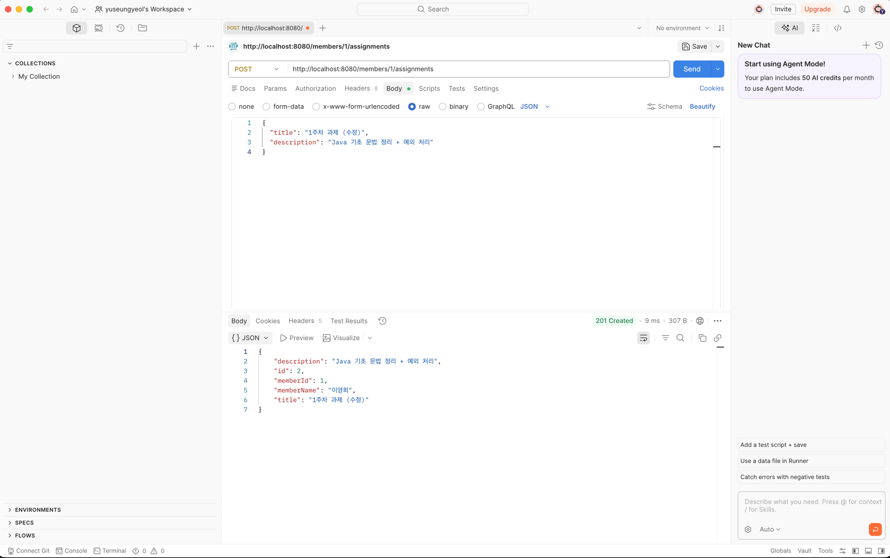
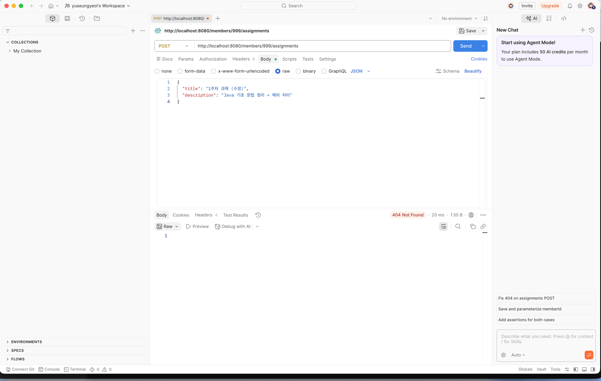
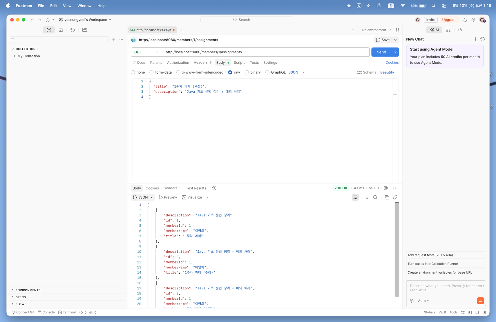
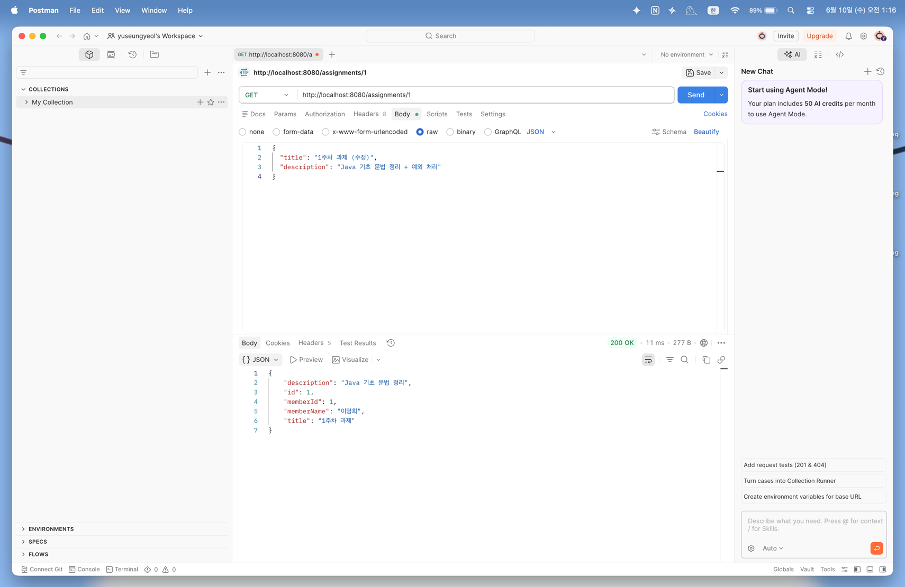
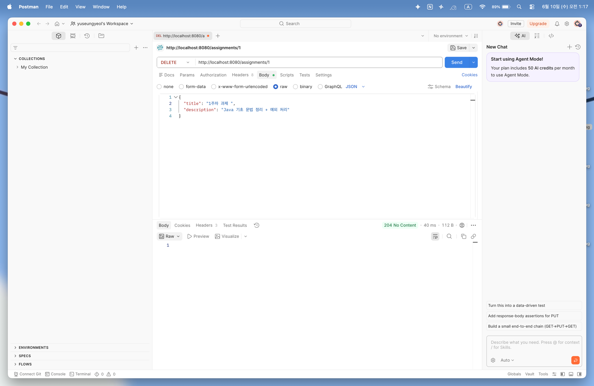
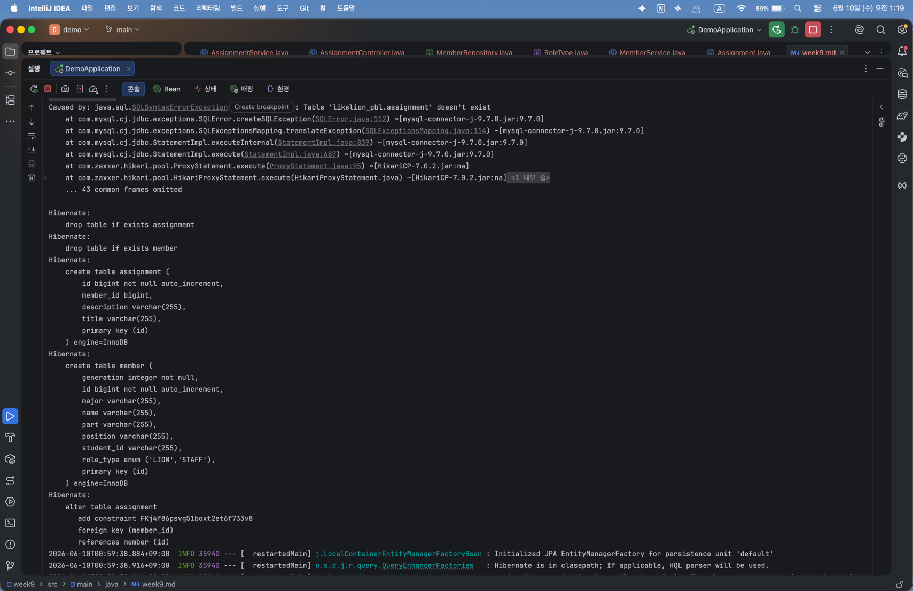
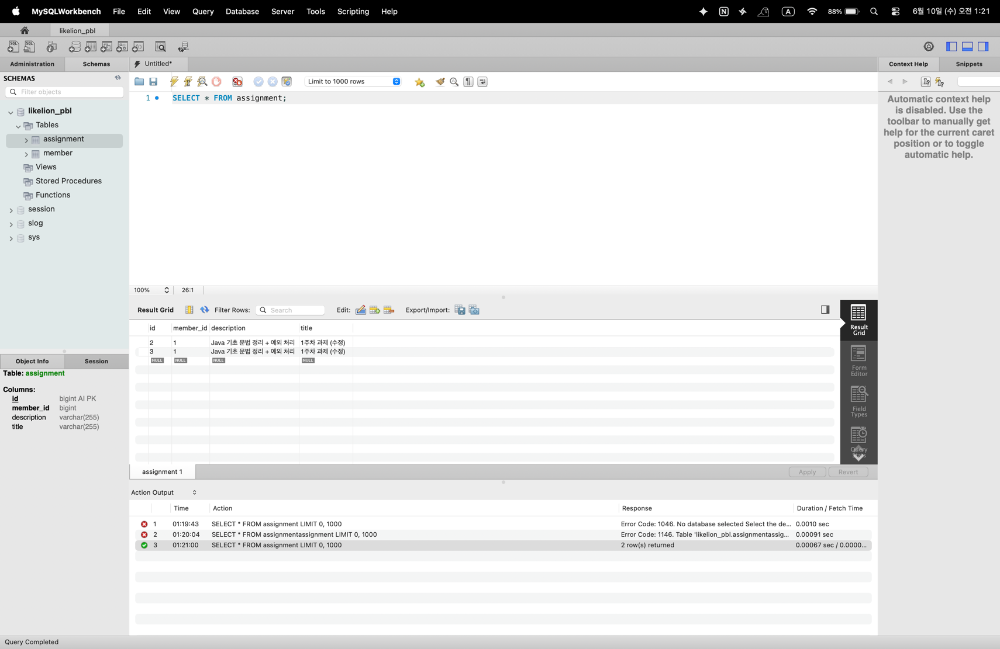

# Today I Learned (Week 9)

## 1. 이번 미션을 통해 배운 내용

- **연관관계 매핑과 DB 외래 키(FK)**: 객체의 참조 구조(1:N)가 관계형 데이터베이스 환경에서 어떻게 외래 키 컬럼(`member_id`)으로 변환되어 테이블 간 조인 관계를 형성하는지 학습함.
- **연관관계의 주인(Owning Side) 개념**: 테이블 구조상 항상 "N" 쪽인 `Assignment`에 외래 키가 존재해야 하므로, 객체 관점에서도 외래 키를 제어하는 주인이 `Assignment`가 됨을 이해하고 `Member` 쪽 필드에 `mappedBy = "member"`를 설정해 읽기 전용 거울 관계로 매핑함.
- **@Transactional 분리 전략**: 클래스 레벨에 `@Transactional(readOnly = true)`를 적용해 단순 조회 시의 아키텍처 성능을 최적화하고, 데이터 변경이 수반되는 생성/수정/삭제 메서드에만 개별 `@Transactional`을 명시해 쓰기 모드로 전환하는 실무 표준 패턴을 습득함.
- **데이터 무결성과 트랜잭션**: 연관관계가 맺어진 상황에서 부모 객체(`Member`)가 부재할 경우 자식 객체(`Assignment`) 등록을 안전하게 차단하여 예외적인 데이터 오염을 방지하는 흐름을 체감함.

## 2. 핵심 정리 (내 언어로)

- **@ManyToOne과 @JoinColumn**: 여러 개의 과제(`Assignment`)가 하나의 회원(`Member`)에게 귀속되는 '다대일' 관계를 맺을 때 자식 엔티티에 `@ManyToOne`을 명시함. 이때 `@JoinColumn(name = "member_id")`을 연이어 선언하여 MySQL의 `assignment` 테이블 내에 어떤 이름으로 외래 키 컬럼을 개설할지 직접 정의함.
- **mappedBy의 명확한 약속**: 양방향 매핑 시 연관관계의 주인이 아닌 쪽에 작성하는 속성으로, "이 필드는 상대방 객체의 member라는 변수에 의해 이미 매핑이 완료되었으니, DB 컬럼을 추가하지 말고 읽기 전용으로만 탐색하라"는 이정표 역할을 수행함.

## 3. 결과 이미지 (Postman 테스트 스크린샷)

### [1] POST - 특정 멤버에게 과제 등록 성공 (201 Created)

- **설명**: `/members/1/assignments` 주소로 POST 요청을 보내 1번 멤버(이영희 사자)에게 첫 번째 과제를 배정함. 응답 결과에 자동으로 발급된 `id: 1`과 외래 키 연결 정보인 `memberId: 1`, `memberName: "이영희"` 상자가 규격대로 정상 도출됨을 검증함.

### [2] POST - 존재하지 않는 멤버에게 과제 등록 실패 예외 처리 (404 Not Found)

- **설명**: 데이터베이스에 없는 번호인 `/members/999/assignments` 경로로 과제 저장을 시도함. 서비스 레이어의 검증 장치에 의해 사전에 걸러져 클라이언트에게 정상적으로 `404 Not Found` 에러 상태 코드가 반환됨을 확인.

### [3] GET - 멤버별 제출 과제 목록 조회 성공 (200 OK)

- **설명**: `GET /members/1/assignments` 주소로 조회를 수행함. 1번 멤버가 제출한 과제들이 JSON 배열 형태(`[ ... ]`)로 한눈에 묶여 출력되며 `200 OK` 사인이 정상 출현함.

### [4] GET - 과제 단건 식별 조회 성공 (200 OK)

- **설명**: 특정 과제의 고유 번호인 `/assignments/1` 경로를 타겟팅하여 GET 요청을 전송함. 영속성 시스템을 통해 1번 과제의 순수 명사 정보 및 작성자 정보가 이상 없이 로드됨.

### [5] PUT - 과제 내용 및 본문 수정 성공 (200 OK)

- **설명**: `PUT /assignments/1` 경로에 새로운 수정용 바디 데이터를 탑재해 전송함. 읽기 전용 트랜잭션이 해제된 쓰기 구역 안에서 더티 체킹 메커니즘이 안전하게 동작하여 `title`과 `description`이 정상 변경됨을 검증함.

### [6] DELETE - 과제 영구 삭제 성공 (204 No Content)

- **설명**: `DELETE /assignments/1` 요청을 날려 과제 저장소 레코드를 안전하게 소멸시킴. 성공 직후 반환할 알맹이가 없음을 선언하는 표준 규격 코드인 **`204 No Content`** 사인이 정상 검출됨을 확인.

### [7] 콘솔 SQL 출력 확인 캡처 (DDL 및 제약조건 형성)

- **설명**: 스프링 부트 서버 구동 시, Hibernate가 자동으로 조립한 디비 명령어를 관측한 화면임. `create table assignment` 구문 내부에 `member_id bigint` 컬럼이 새롭게 파싱되고, 하단에 외래 키 제약 조건 지정을 위한 `add constraint FK... foreign key (member_id) references member (id)` DDL 쿼리가 무사히 실행되는 것을 증명함.

### [8] MySQL Workbench 테이블 관계 조인 연동 실시간 확인

- **설명**: 워크벤치 쿼리 창에서 멘토님이 제시한 `SELECT * FROM assignment;`와 테이블 두 개를 직접 엮어 확인하는 교차 조인 쿼리(`JOIN member m ON a.member_id = m.id`)를 수행한 실시간 화면임. `member_id`에 상응하는 부모 PK 키값들이 오차 없이 적재되어 양방향 정합성을 완벽하게 보존하고 있음을 최종 확인함.

## 4. 미션 수행 후 느낀 점

지난 회차에서 단일 테이블 구조를 마스터한 것에 이어, 이번 9주차에는 실제 현업 백엔드 아키텍처의 핵심 축이라 볼 수 있는 '연관관계 매핑'을 직접 구현해 볼 수 있어 깊이 있는 성장을 이룰 수 있었습니다.
자바의 가상 참조 링크 방식과 데이터베이스의 선형적인 외래 키(FK) 정렬 방식 간의 차이를 해결하기 위해 '연관관계의 주인'을 설정해 주어야만 하는 당위성을 깨닫게 된 점이 가장 흥미로웠습니다.
더불어 서비스 계층에 `@Transactional`을 적용하여 무분별한 데이터 변경 감지를 억제하는 리드온리 분리 전략을 직접 조율해 보며, 단순 구현을 넘어 시스템의 리소스 최적화와 트랜잭션 원자성 확보가 얼마나 중요한지 몸소 깨닫게 된 뜻깊은 실습이었습니다!
